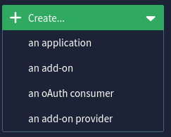
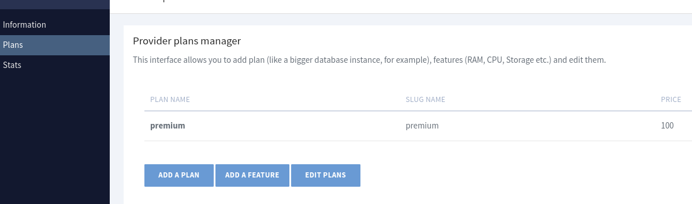
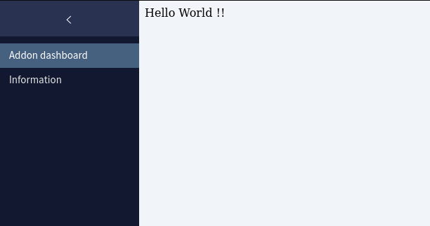

# Get started with Clever Cloud `add-on api`

The Clever Cloud `add-on api` expose a service as a *Clever Cloud add-on* to organization's users or Clever Cloud's users.

> Through all this document we will talk about **exposing a service through an organization**. To expose a service to all organization as *Clever Cloud's partner add-on's providers*, the process is the same. The scope policy can be updated by the Clever Cloud teams. Contact [partnership@clever-cloud.com](partnership@clever-cloud.com) or [support@clever-cloud.com](support@clever-cloud.com).

> For historical reasons, in Clever Cloud we are used to talk about **add-on**. However, it **would be more understandable to talk about `services`**. In this document we will mainly use the terms of `add-on`. Consider it in the same way as `managed services`.

## Main ressource

The official documentation is available on [https://www.clever-cloud.com/doc/extend/add-ons-api/](https://www.clever-cloud.com/doc/extend/add-ons-api/).

## Vocabulary and concepts

In the context of an add-on creation or to expose a service through an add-on, we will consider three point of view useful to understand the `add-on api`.

- The `add-on back-end` which handle the user's request for an add-on

  - Can be hosted on any infrastructure

- The `add-on interface` with which the end-user will interact with

  - User interface on Clever Cloud. It is a way for the provider to display specifics informations in the Clever Cloud console

- The `add-on api back-end` which is the link between *Clever Cloud users* and *add-on's providers*

  - **Managed and ran by Clever Cloud**

## How to deploy your own add-on
To deploy your own service on Clever Cloud through the `add-on api`, you need to provide an `add-on back-end` and set-up an `add-on interface`
We will assume your `add-on back-end` is ready and up for this section. If not refer to the [add-on back-end section](#the-add-on-back-end).

### Configure the `add-on api`
#### 1. on the top left of your organization Clever Cloud console, click on `+ create` and  select `an add-on provider`

  

#### 2. add your json file manifest
```json
{
  "id": "addon_provider_demo",
  "name": "addon_provider",
  "api": {
    "config_vars": [],
    "regions": ["eu"],
    "password": "<LONG_RANDOM_PASS_PHRASE>",
    "sso_salt": "<LONG_RANDOM_TOKEN>",
    "production": {
      "base_url": "http://demo_addon_provider.cleverapps.io/addon_management",
      "sso_url": "http://demo_addon_provider.cleverapps.io/"
    },
    "test": {
      "base_url": "http://demo_addon_provider.cleverapps.io/addon_management",
      "sso_url": "http://demo_addon_provider.cleverapps.io/"
    }
  }
}
```

The `id` must be **unique** through all Clever Cloud add-ons.

> Use a **specific** and **explicit** `id` to make sure your as using a unique one

Make sure that `api/production/base_url` and `api/test/base_url` are **the same**

Make sure that `api/production/sso_url` and `api/test/sso_url` are **the same**.

> *test* endpoints are used just after the add-on provider creation. Then the production endpoint is used

the `base_url` is the endpoint of your `add-on back-end` wich handle `create`, `deletion` and `plan change` refer to  [`the base url endpoint section`](#the-baseurl-endpoint)

the `sso_url` return the custom add-on panel displayed in the `Clever Cloud Console` refer to [the sso url endpoint section](#the-ssourl-endpoint)

[more info about the manifest in the main documentation](https://www.clever-cloud.com/doc/extend/add-ons-api/#build-an-add-on)

#### 3. create some plan for your add-on
  Once your manifest has been sent. You can set-up some plan for your `add-on`
  

  >You can also add some feature at your plans by the `edit plans` button

  **At least one plan must be done !**

#### 4. **Once you have at least one plan done. Contact the [Clever Cloud team](partnership@clever-cloud.com) to activate the provider**

  > currently plans must be linked to a zone manually by someone from the Clever Cloud team. It is about to change


## The add-on back-end
### the `base_url` endpoint
- It is the main endpoint for your `add-on back-end`. Each request for [provisioning](https://www.clever-cloud.com/doc/extend/add-ons-api/#provisioning), [deprovisioning](https://www.clever-cloud.com/doc/extend/add-ons-api/#deprovisioning) or [plan change](https://www.clever-cloud.com/doc/extend/add-ons-api/#plan-change) would be done on this url.

- It must be `https` connexion
- The call is secure by a `Basic authentication`
    - the `username` is your `provider id`
      >*`addon_provider_demo` in [the example](#2-add-your-json-file-manifest)*    
    - the `password` is  the value of the `password` field from the manifest
      >*`<LONG_RANDOM_PASS_PHRASE>` in [the example](#2-add-your-json-file-manifest)*

### the `sso_url` endpoint
- It is the endpoint called by the `Add-on dashboard` panel from the *provided add-on* in the client side `Clever Cloud console`

    

- The call is secured by a `token`
  - The `Clever Cloud api` send a `POST` https request with a field `id`, `token` and `timestamp` in the form
  - the `token` is a `sha1` hash of ```id:SALT:timestamp```
  > note the `:` between all the values
  - `SALT` had been provided in the `manifest`
      >*`<LONG_RANDOM_TOKEN>` in [the example](#2-add-your-json-file-manifest)*

  - **You have to check that your computed token match the provided one**

### A toy example
In the `example` folder we provide a minimal example in Python to understand how the back-end and the add-on api can work together.

It is not a production ready code, but an easy to understand example.

This example manage python application as service

There is three files :
- `addon-dashboard.py`

  It provides the [the sso url endpoint](#the-ssourl-endpoint) response using the token authentification

- `backend.py`

  It manages the services required by the add-on api. It responds to [`the base url endpoint`](#the-baseurl-endpoint) using the basic authentification

- `clever_client.py`

  It is a really simple Clever Cloud Python client based on the Command Line Interface  ([more information on the documentation page](https://www.clever-cloud.com/doc/reference/clever-tools/getting_started/))

  To work, a `CLEVER_SECRET` environement variable must be set with the backend application. That allow to used the Clever Cloud CLI